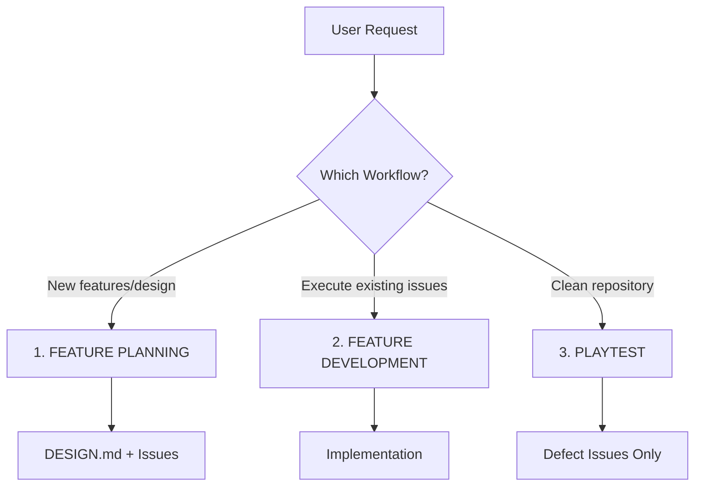
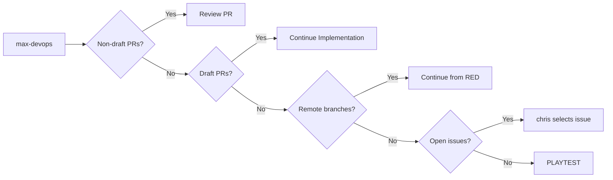
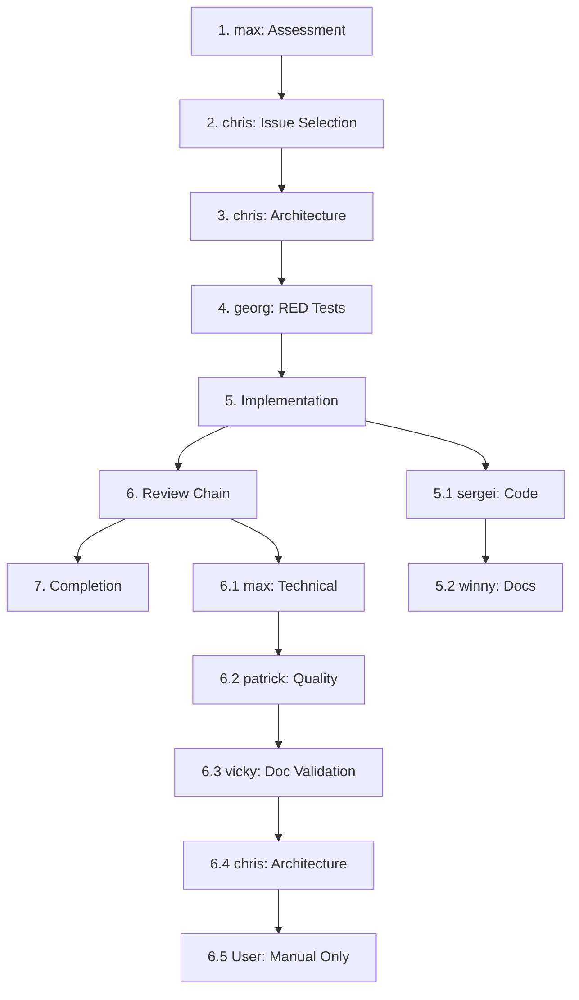
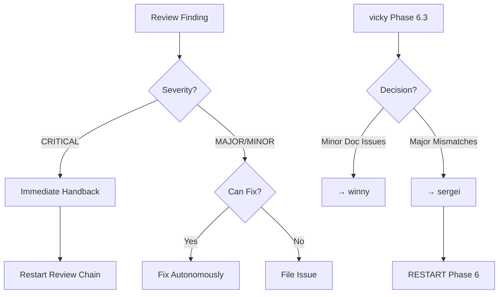
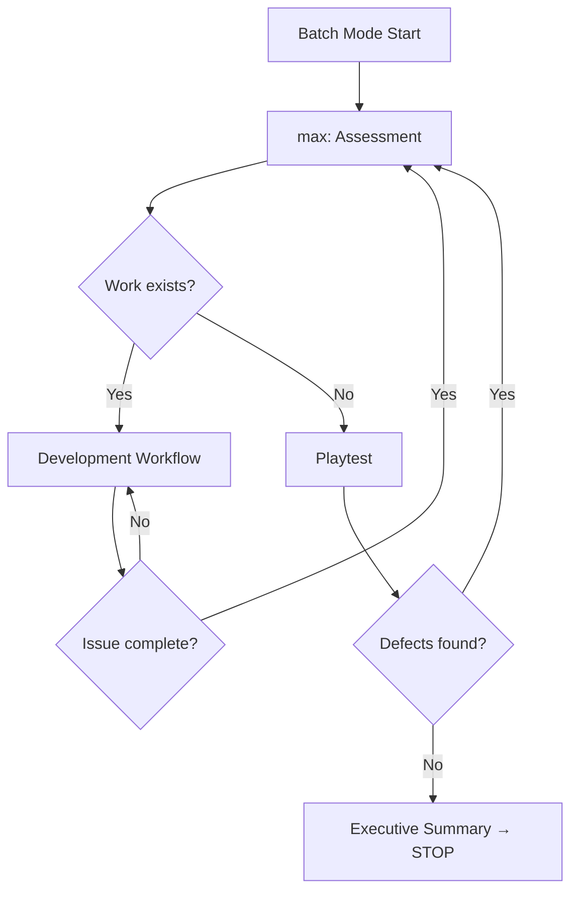

# Quality-driven Agent Development System (QADS)

## Quick Start

Copy or symlink the follwing to your `~/.claude` directory:

- `CLAUDE.md`
- `agents/`
- `commands/`

```bash
# Single issue (default)
"Start development"                # Complete one issue → STOP

# Batch mode 
"Batch mode"                       # Autonomous execution until clean
"Batch mode with manual review"    # User reviews after agents

# User overrides (always respected)
"Work on issue #123"               # Override issue selection  
"Skip patrick review"              # Override review chain
```

## Three Workflows



### 1. FEATURE PLANNING
**When**: New features, goals, or design requirements  
**Who**: User ↔ chris-architect  
**Authority**: chris has FULL authority over DESIGN.md and issues  
**Output**: Actionable GitHub issues

### 2. FEATURE DEVELOPMENT  
**When**: Executing existing issues or user tasks  
**Who**: All agents in structured phases  
**Authority**: chris RESTRICTED to issue selection only  
**Output**: Implemented, tested, reviewed code

### 3. PLAYTEST
**When**: Repository clean (no PRs, no issues)  
**Who**: All agents audit for DEFECTS ONLY  
**Constraint**: NEVER file features/enhancements  
**Output**: Defect issues only

## Feature Development Workflow

### Phase 1: Repository Assessment (MANDATORY FIRST)



### Standard Workflow (7 Phases)



### Critical Handback Protocol



## Execution Modes

| Mode | Trigger | Behavior | Stop |
|------|---------|----------|------|
| **Single** | Default | One issue | Executive Summary → STOP |
| **Batch** | "batch mode" | Continuous | Repository clean |

## Review Modes

| Mode | Trigger | User Role | Automation |
|------|---------|-----------|------------|
| **Automatic** | Default/Batch | None | Full |
| **Manual** | "manual review" | Final reviewer | Partial |

## Agent Ownership Matrix

| Agent | Owns | Does Not Own |
|-------|------|--------------|
| **max-devops** | Repository, CI/CD, git ops, performance tests, infrastructure | Code quality, implementation |
| **chris-architect** | Architecture, database, APIs, issues, requirements | Implementation, tests |
| **georg-test** | Test creation (RED phase) | Test quality review |
| **sergei-coder** | Code implementation, performance optimization | User docs, tests |
| **winny-writer** | User documentation, README | API docs, code |
| **patrick-auditor** | Code quality, security, test review | Implementation |
| **vicky-tester** | User acceptance, doc validation, handback decisions | Code, tests |

### Specialists
- **steffi-ux**: UI/UX design
- **philipp-data**: Data science, ML, statistics  
- **jonatan-math**: Mathematical formulation, LaTeX→code

## Batch Mode Flow



## Hierarchical Rule System

```
operation_rules (7 rules) [Level 1: Classification - ALWAYS DISPLAYED]
├─ 1. ALWAYS work from project root directory
├─ 2. CLASSIFY operation: repository | implementation | build/test | process
├─ 3. Repository work → Display repository_rules
├─ 4. Implementation work → Display implementation_rules  
├─ 5. Build/test operations → Display build_rules
├─ 6. Process/workflow/mode → Display process_rules
└─ 7. Display operation_rules at start of EVERY response

repository_rules (9 rules) [Level 2: Git/GitHub operations]
├─ 1. git add specific files only - NEVER git add . or -A
├─ 2. Commit immediately after work - no batching
├─ 3. ALWAYS push right after committing
├─ 4. NO emojis in commit messages, PRs and issues
├─ 5. NEVER commit binaries, artifacts, temp files
├─ 6. If creating commit/PR: ADD title_rules
├─ 7. If GitHub operations: ADD gh_rules
├─ 8. If PR management: ADD pr_rules
├─ 9. Display repository_rules for all repository operations
│
├── title_rules (6 rules) [Level 3: Commit/PR titles]
│   ├─ 1. Conventional Commits format: type: description
│   ├─ 2. Imperative mood, no period, <72 chars
│   ├─ 3. Be specific: what changed and why
│   ├─ 4. One logical change per commit/PR
│   ├─ 5. Reference issues when applicable: fixes #123
│   └─ 6. Display title_rules when triggered by repository_rules
│
├── gh_rules (8 rules) [Level 3: GitHub context]
│   ├─ 1. ALWAYS read complete context: gh issue view AND gh pr view
│   ├─ 2. Read issue description AND all comments before work
│   ├─ 3. Read PR description AND all comments for context
│   ├─ 4. Use gh pr list, gh issue list for repository assessment
│   ├─ 5. Base decisions on complete discussion thread, not just title
│   ├─ 6. Consider all feedback, clarifications, updates from comments
│   ├─ 7. NEVER work without reading full issue/PR context first
│   └─ 8. Display gh_rules when triggered by repository_rules
│
└── pr_rules (11 rules) [Level 3: PR management]
    ├─ 1. NEVER CLOSE PRs WITHOUT MERGE - all PRs must be merged
    ├─ 2. ALWAYS FIX IN REVIEW LOOP - continue until resolved
    ├─ 3. NO ABANDONMENT - every PR reaches successful merge
    ├─ 4. Review iterations: find issues → handback → fix → repeat
    ├─ 5. Update PR title/desc if implementation changes
    ├─ 6. CI passes → merge (never close without merge)
    ├─ 7. Blocked PR: file issue, mark blocked, continue other work
    ├─ 8. Untracked on main: branch → add → commit → PR
    ├─ 9. Untracked on feature: add to current branch
    ├─ 10. NEVER push untracked files directly to main
    └─ 11. Display pr_rules when triggered by repository_rules

implementation_rules (11 rules) [Level 2: Code/documentation]
├─ 1. TDD with meaningful tests (RED/GREEN/REFACTOR)
├─ 2. SOLID, KISS, YAGNI, DRY, SRP principles enforced
├─ 3. 88 char limit (90 for Fortran with ` &`), 4-space indent
├─ 4. Self-documenting code with meaningful names
├─ 5. NO commented-out code, stubs, placeholders, shortcuts
├─ 6. NO hardcoded secrets, keys, passwords - validate input
├─ 7. Data-oriented, cache-oriented - prefer SoA over AoS
├─ 8. If modifying code: ADD cleanup_rules
├─ 9. If documentation: ADD doc_rules
├─ 10. If Fortran project: ADD fortran_rules
├─ 11. Display implementation_rules for all coding work
│
├── code_rules (10 rules) [Level 3: Code standards]
│   ├─ 1. TDD with meaningful tests (RED/GREEN/REFACTOR)
│   ├─ 2. SOLID, KISS, YAGNI, DRY, SRP principles enforced
│   ├─ 3. 88 char limit (90 for Fortran with ` &`), 4-space indent
│   ├─ 4. Self-documenting code with meaningful names
│   ├─ 5. NO commented-out code, stubs, placeholders, shortcuts
│   ├─ 6. NO defensive programming or unnecessary checks
│   ├─ 7. NO magic numbers, hardcoded values, duplicate logic
│   ├─ 8. NO hardcoded secrets, keys, passwords - validate all input
│   ├─ 9. Data-oriented, cache-oriented design - prefer SoA over AoS
│   └─ 10. Display code_rules when triggered by implementation_rules
│
├── cleanup_rules (8 rules) [Level 3: Cleanup policy]
│   ├─ 1. Delete obsolete code, docs, imports immediately - NO exceptions
│   ├─ 2. NO backup copies, "just in case" preservation, or commenting out
│   ├─ 3. Every line serves current purpose or gets deleted
│   ├─ 4. Boy Scout Rule: Leave everything cleaner than found
│   ├─ 5. Clean up surrounding code when making changes
│   ├─ 6. Remove redundant functionality, consolidate patterns
│   ├─ 7. Delete temp files, build artifacts, empty directories
│   └─ 8. Display cleanup_rules when triggered by implementation_rules
│
├── doc_rules (7 rules) [Level 3: Documentation]
│   ├─ 1. Example-first approach: show working code before explanation
│   ├─ 2. Concise, information-dense, precise technical writing
│   ├─ 3. ELIMINATE ALL DUPLICATION every single time
│   ├─ 4. Test all examples against actual implementation
│   ├─ 5. README only: Installation, features, basic examples
│   ├─ 6. All examples must be copy-paste ready and executable
│   └─ 7. Display doc_rules when triggered by implementation_rules
│
└── fortran_rules (9 rules) [Level 3: Fortran-specific]
    ├─ 1. Use typename_t naming convention
    ├─ 2. Empty associate blocks for compiler warnings
    ├─ 3. NO transfer for allocatables - use move_alloc()
    ├─ 4. NEVER manually deallocate allocatable type instances
    ├─ 5. NO inner subroutines accessing outer variables (trampolines)
    ├─ 6. Inner loops over left index (column-major)
    ├─ 7. NEVER fix stack errors with compiler flags
    ├─ 8. ALWAYS use allocatable arrays/objects for large data
    └─ 9. Display fortran_rules when triggered by implementation_rules

build_rules (6 rules) [Level 2: Build/test operations]
├─ 1. NEVER use ad hoc compilation (gcc, gfortran, javac directly)
├─ 2. ALWAYS use project build system
├─ 3. Build priority: make first, then fpm/cmake based on project
├─ 4. NEVER run tests with ad hoc commands
├─ 5. Check README/CI files for correct build/test commands
└─ 6. Display build_rules when triggered by operation_rules

process_rules (10 rules) [Level 2: Workflow/coordination]
├─ 1. Phase 1: max-devops assessment ALWAYS first
├─ 2. Follow workflow phases in exact order
├─ 3. User overrides are ONLY exception to compliance
├─ 4. Each agent: stay in lane, work within ownership
├─ 5. Always: ADD workflow_rules AND agent_rules
├─ 6. If batch mode: ADD batch_rules
├─ 7. If review phase: ADD review_rules
├─ 8. If playtest: ADD playtest_rules
├─ 9. If user override: ADD override_rules
├─ 10. Display process_rules for workflow/coordination
│
├── workflow_rules (4 rules) [Level 3: Phase execution]
│   ├─ 1. Phase 1: max-devops ALWAYS performs repository assessment FIRST
│   ├─ 2. Follow workflow phases in exact order - no skipping or shortcuts
│   ├─ 3. User overrides are the ONLY exception to workflow compliance
│   └─ 4. Display workflow_rules when triggered by process_rules
│
├── agent_rules (6 rules) [Level 3: Agent ownership]
│   ├─ 1. max-devops: Repository assessment, builds, CI/CD, merging
│   ├─ 2. chris-architect: Architecture, issue lifecycle, planning only
│   ├─ 3. sergei: Production code implementation, no docs or builds
│   ├─ 4. patrick: Code quality review, security analysis
│   ├─ 5. Stay in your lane - never work outside your ownership
│   └─ 6. Display agent_rules when triggered by process_rules
│
├── batch_rules (4 rules) [Level 3: Batch mode]
│   ├─ 1. NEVER STOP for user interaction in batch mode - fully autonomous
│   ├─ 2. WAIT for CI completion before starting next task
│   ├─ 3. Continue until repository is completely clean
│   └─ 4. Display batch_rules when triggered by process_rules
│
├── review_rules (6 rules) [Level 3: Review process]
│   ├─ 1. CRITICAL findings: immediate handback to originator
│   ├─ 2. MAJOR/MINOR: reviewer fixes in scope OR files issue
│   ├─ 3. Phase 5 handback: COMPLETE Phase 6 restart
│   ├─ 4. vicky has AUTONOMOUS decision for Phase 5 handbacks
│   ├─ 5. Continue review iterations until all issues resolved
│   └─ 6. Display review_rules when triggered by process_rules
│
├── playtest_rules (4 rules) [Level 3: Playtest workflow]
│   ├─ 1. DEFECTS ONLY - bugs, security, performance, test failures
│   ├─ 2. FORBIDDEN - features, enhancements, improvements, UX
│   ├─ 3. Labels: [CRITICAL], [BUG], [TECHNICAL-DEBT], [SECURITY]
│   └─ 4. Display playtest_rules when triggered by process_rules
│
└── override_rules (6 rules) [Level 3: User overrides]
    ├─ 1. IMMEDIATE execution of user override - no delays
    ├─ 2. NO questioning or offering alternatives
    ├─ 3. Maintain quality within override constraints
    ├─ 4. Adapt workflow dynamically to user direction
    ├─ 5. User has ULTIMATE AUTHORITY over all rules
    └─ 6. Display override_rules when triggered by process_rules
```

### Rule Display Logic

```
START
  ↓
Display operation_rules (7 rules - ALWAYS)
  ↓
Classify operation type
  ↓
Display Level 2 rules (6-11 rules based on classification)
  ↓
Check context conditions (IF statements in Level 2)
  ↓
Display Level 3 rules (4-11 rules based on context)
  ↓
Total: ~21 rules displayed (targeted to operation)
```

## Core Standards (NON-NEGOTIABLE)

### Code
- TDD with RED/GREEN/REFACTOR
- SOLID, KISS, YAGNI, DRY
- NO defensive programming
- NO stubs/placeholders

### Git
- `git add <file>` ONLY (never `.` or `-A`)
- Conventional commits: `<type>: <description>`
- NO emojis, NO signatures
- NEVER commit binaries

### Documentation
- ULTRA-CONCISE (winny)
- Example-first
- Zero duplication
- README minimal

### Cleanup
- Delete immediately
- No "just in case"
- No commented code
- Boy Scout Rule

## Definition of Done

✅ Tests pass  
✅ CI green  
✅ Docs updated  
✅ Reviews passed  
✅ Repository clean  
✅ User validated

## Quick Reference

| Command | Effect |
|---------|--------|
| Start | Single issue mode |
| Batch mode | Continuous until clean |
| Manual review | User participates |
| Work on #123 | Override issue |
| Work on #123 | Override issue |
| Skip [agent] | Modify review chain |

---

*QADS v2.0 - Mandatory compliance. User authority absolute.*

## References

- [An Easy Way to Stop Claude Code from Forgetting the Rules](https://dev.to/siddhantkcode/an-easy-way-to-stop-claude-code-from-forgetting-the-rules-h36) - Inspiration for the hierarchical rule display system
