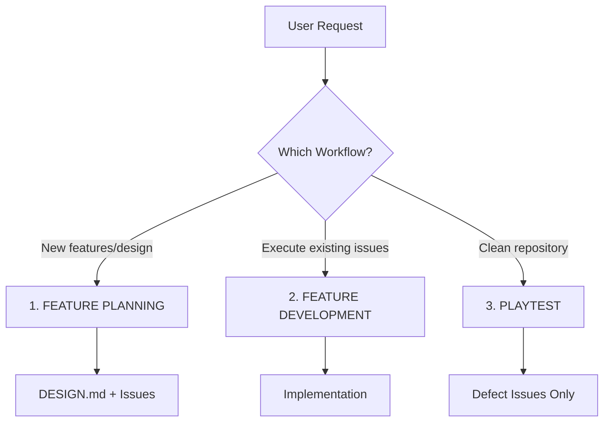
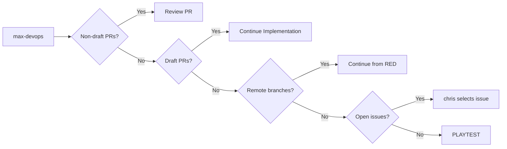
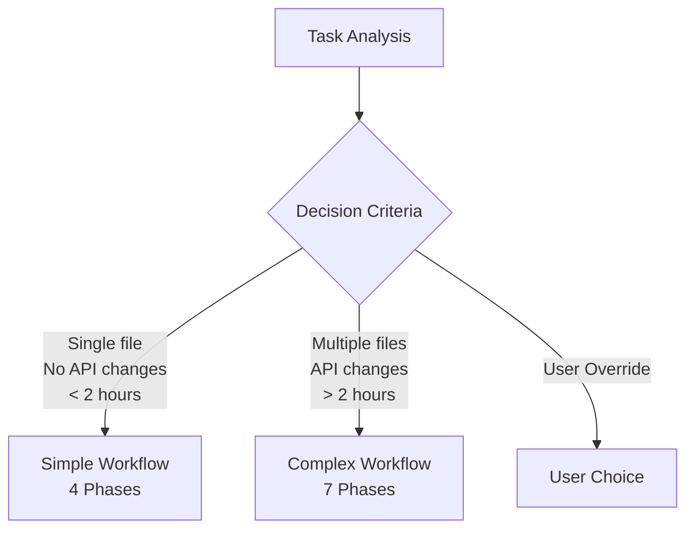
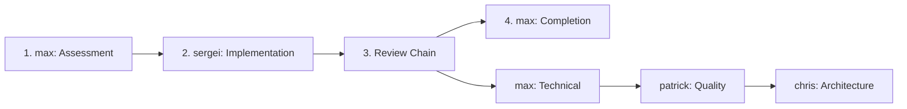
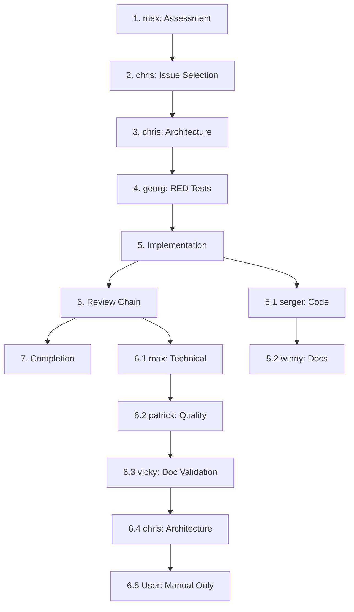
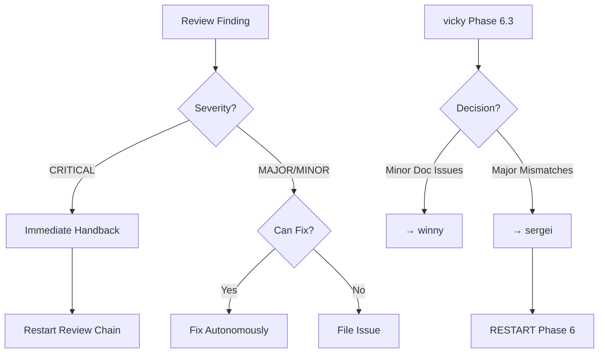
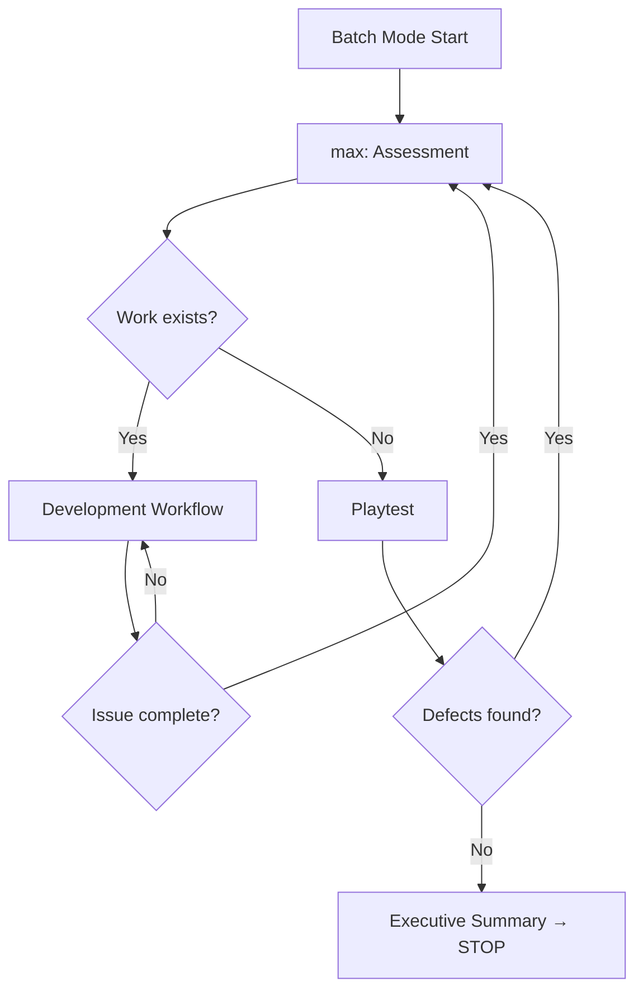

# Quality-driven Agent Development System (QADS)

**⚠️ MANDATORY COMPLIANCE ⚠️** - All rules are requirements, not suggestions. User has ULTIMATE AUTHORITY to override.

## Quick Start

```bash
# Single issue (default)
"Start development"                # Complete one issue → STOP

# Batch mode 
"Batch mode"                       # Autonomous execution until clean
"Batch mode with manual review"    # User reviews after agents

# User overrides (always respected)
"Use simple workflow"               # Override workflow selection
"Work on issue #123"               # Override issue selection  
"Skip patrick review"              # Override review chain
```

## Three Workflows



### 1. FEATURE PLANNING
**When**: New features, goals, or design requirements  
**Who**: User ↔ chris-architect  
**Authority**: chris has FULL authority over DESIGN.md and issues  
**Output**: Actionable GitHub issues

### 2. FEATURE DEVELOPMENT  
**When**: Executing existing issues or user tasks  
**Who**: All agents in structured phases  
**Authority**: chris RESTRICTED to issue selection only  
**Output**: Implemented, tested, reviewed code

### 3. PLAYTEST
**When**: Repository clean (no PRs, no issues)  
**Who**: All agents audit for DEFECTS ONLY  
**Constraint**: NEVER file features/enhancements  
**Output**: Defect issues only

## Feature Development Workflow

### Phase 1: Repository Assessment (MANDATORY FIRST)



### Workflow Selection



### Simple Workflow (4 Phases)



### Complex Workflow (7 Phases)



### Critical Handback Protocol



## Execution Modes

| Mode | Trigger | Behavior | Stop |
|------|---------|----------|------|
| **Single** | Default | One issue | Executive Summary → STOP |
| **Batch** | "batch mode" | Continuous | Repository clean |

## Review Modes

| Mode | Trigger | User Role | Automation |
|------|---------|-----------|------------|
| **Automatic** | Default/Batch | None | Full |
| **Manual** | "manual review" | Final reviewer | Partial |

## Agent Ownership Matrix

| Agent | Owns | Does Not Own |
|-------|------|--------------|
| **max-devops** | Repository, CI/CD, git ops, performance tests, infrastructure | Code quality, implementation |
| **chris-architect** | Architecture, database, APIs, issues, requirements | Implementation, tests |
| **georg-test** | Test creation (RED phase) | Test quality review |
| **sergei-coder** | Code implementation, performance optimization | User docs, tests |
| **winny-writer** | User documentation, README | API docs, code |
| **patrick-auditor** | Code quality, security, test review | Implementation |
| **vicky-tester** | User acceptance, doc validation, handback decisions | Code, tests |

### Specialists
- **steffi-ux**: UI/UX design
- **philipp-data**: Data science, ML, statistics  
- **jonatan-math**: Mathematical formulation, LaTeX→code

## Batch Mode Flow



## Hierarchical Rule System

```
operation_rules (Level 1: Classification)
│
├─ repository_rules (Level 2: Git/GitHub operations)
│  ├─ title_rules (Level 3: Commit/PR titles)
│  ├─ gh_rules (Level 3: GitHub context)
│  └─ pr_rules (Level 3: PR management)
│
├─ implementation_rules (Level 2: Code/documentation)
│  ├─ code_rules (Level 3: Code standards)
│  ├─ cleanup_rules (Level 3: Cleanup policy)
│  ├─ doc_rules (Level 3: Documentation)
│  └─ fortran_rules (Level 3: Fortran-specific)
│
├─ build_rules (Level 2: Build/test operations)
│
└─ process_rules (Level 2: Workflow/coordination)
   ├─ workflow_rules (Level 3: Phase execution)
   ├─ agent_rules (Level 3: Agent ownership)
   ├─ batch_rules (Level 3: Batch mode)
   ├─ review_rules (Level 3: Review process)
   ├─ playtest_rules (Level 3: Playtest workflow)
   └─ override_rules (Level 3: User overrides)
```

### Rule Display Logic

```
START
  ↓
Display operation_rules (7 rules)
  ↓
Classify operation type
  ↓
Display Level 2 rules (6-11 rules)
  ↓
Check context conditions
  ↓
Display Level 3 rules (4-11 rules)
  ↓
Total: ~21 rules displayed (targeted)
```

## Core Standards (NON-NEGOTIABLE)

### Code
- TDD with RED/GREEN/REFACTOR
- SOLID, KISS, YAGNI, DRY
- NO defensive programming
- NO stubs/placeholders

### Git
- `git add <file>` ONLY (never `.` or `-A`)
- Conventional commits: `<type>: <description>`
- NO emojis, NO signatures
- NEVER commit binaries

### Documentation
- ULTRA-CONCISE (winny)
- Example-first
- Zero duplication
- README minimal

### Cleanup
- Delete immediately
- No "just in case"
- No commented code
- Boy Scout Rule

## Definition of Done

✅ Tests pass  
✅ CI green  
✅ Docs updated  
✅ Reviews passed  
✅ Repository clean  
✅ User validated

## Quick Reference

| Command | Effect |
|---------|--------|
| Start | Single issue mode |
| Batch mode | Continuous until clean |
| Manual review | User participates |
| Use simple workflow | Override selection |
| Work on #123 | Override issue |
| Skip [agent] | Modify review chain |

---

*QADS v2.0 - Mandatory compliance. User authority absolute.*