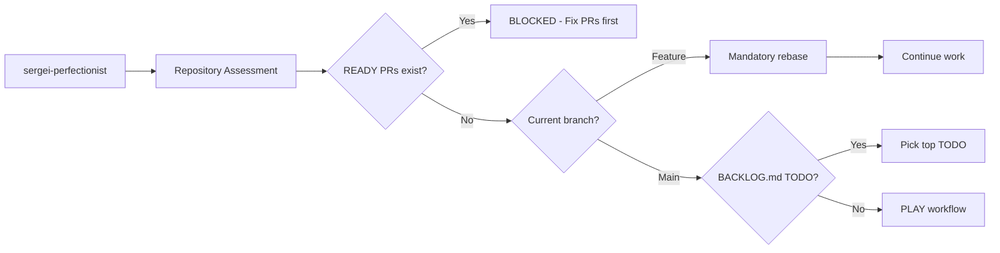

# Quality-driven Agent Development System (QADS) v3.0

## Quick Start

Copy or symlink the following to your `~/.claude` directory:

- `CLAUDE.md`
- `agents/`
- `commands/`

```bash
# Shortcuts for each workflow
"plan"    # Planning workflow - create issues and BACKLOG.md
"work"    # Work workflow - implement from BACKLOG.md
"play"    # Play workflow - find defects only

# Batch operations
"batch work"   # Process all BACKLOG.md TODO items
"batch play"   # Continuous defect finding loop
```

## Three Core Workflows


### 1. PLAN WORKFLOW (shortcut: `"plan"`)
**Trigger**: User requests planning, design, or new features  
**Actor**: chris-architect ONLY  
**Authority**: FULL control of BACKLOG.md and issue creation  
**Protocol**:
1. Create/update GitHub issues
2. Update BACKLOG.md with ordered priorities
3. Update DESIGN.md as needed
4. **MANDATORY**: Commit and push BACKLOG.md immediately

### 2. WORK WORKFLOW (shortcut: `"work"`)
**Trigger**: Issues exist in BACKLOG.md or current branch work  
**Actors**: sergei → patrick → (user if manual) → max  
**Protocol**:
1. **sergei**: Repository assessment + implementation
   - Assess repository, check current branch first
   - **🚨 MANDATORY REBASE**: `git rebase origin/main` before continuing work
   - Update BACKLOG.md (TODO→DOING), implement code, create PR
2. **patrick**: Run tests FIRST, then review code
3. **user**: Review if manual mode
4. **max**: Final merge
   - **🚨 MANDATORY REBASE**: `git rebase origin/main` + `git push --force-with-lease`
   - Wait for CI completion, merge PR, close issue

### 3. PLAY WORKFLOW (shortcut: `"play"`)
**Trigger**: BACKLOG.md empty (all issues resolved)  
**Working Directory**: Separate clone/worktree  
**Actors**: max → winny → parallel audits → chris  
**Protocol**:
1. **max**: Pull latest main, git clean -fdx
2. **winny**: Complete documentation rewrite
3. **Parallel audits**: patrick (dead code), vicky (bugs) - file issues immediately
4. **chris**: Clear DONE section, update BACKLOG.md with new issues, commit and push

## BACKLOG.md Management

### Format
```markdown
# Development Backlog

## TODO (Ordered by Priority)
- [ ] #123: Implement user authentication
- [ ] #456: Add data validation
- [ ] #789: Update documentation

## DOING (Current Work)
- [x] #101: Fix memory leak (branch: fix-memory-leak-101)

## DONE (Completed)
- [x] #100: Setup CI pipeline
```

### Operations

**Chris's BACKLOG.md Workflow**:
1. Create/update GitHub issues
2. Edit BACKLOG.md: Add issues to TODO, order by priority
3. PLAY mode: Clear DONE section before adding new TODO items
4. **MANDATORY**: `git add BACKLOG.md && git commit -m "plan: update BACKLOG.md" && git push`

**Sergei's Complete Workflow (Repository Assessment + Implementation)**:
1. **Repository Assessment**:
   - `git fetch --all && git status` - update remotes and check state
   - `gh pr list --state open --draft=false` - check for READY PRs only
   - **🚨 CRITICAL**: If ANY READY PRs exist, BLOCKED from new work
2. **Branch Management**:
   - **If on feature branch**: **🚨 MANDATORY REBASE**: `git rebase origin/main`
   - **If on main branch**: Start new work ONLY if no READY PRs exist
3. **BACKLOG.md Management**:
   - Move completed DOING → DONE
   - Pick top TODO → DOING
   - Create branch: `git checkout -b <type>-<number>`
   - **MANDATORY**: `git add BACKLOG.md && git commit -m "update: move issue #X to DOING" && git push -u origin <branch>`
4. **Implementation**: Write tests, implement code, create PR

**Max's Role**:
- **Final merge operations only** (sergei handles initial assessment)
- **🚨 MANDATORY REBASE**: `git rebase origin/main` before merge
- Wait for CI completion before merge
- Close issues after merge (auto-moves to DONE)

## Repository Assessment (sergei-perfectionist FIRST)



**Quick Assessment Protocol (sergei performs)**:
1. `git fetch --all && git status` - update remotes and check state
2. `gh pr list --state open --draft=false` - check for READY PRs only
3. **🚨 MANDATORY REBASE** if on feature branch
4. Check BACKLOG.md DOING section
5. Check BACKLOG.md TODO section

## Batch Mode

| Command | Behavior | Stop Condition |
|---------|----------|----------------|
| `"batch work"` | Process all TODO items | BACKLOG.md TODO empty |
| `"batch play"` | Continuous defect finding | Never (loop forever) |

**Batch characteristics**:
- FULLY AUTONOMOUS - no user interaction
- Wait for CI between tasks
- Skip manual review phase

## Agent Ownership

| Agent | Owns | Restrictions |
|-------|------|--------------|
| **max-devops** | Final merge, CI/CD, closing issues | Cannot modify code, sergei handles initial assessment |
| **chris-architect** | BACKLOG.md, issues, DESIGN.md, architecture | MUST commit/push BACKLOG.md |
| **sergei-perfectionist** | Repository assessment, code implementation, BACKLOG.md status updates | MUST commit/push BACKLOG.md, MUST rebase |
| **patrick-auditor** | Code quality review (WORK), issue filing (PLAY) | Cannot modify implementation |
| **winny-technical-writer** | Documentation consolidation (PLAY only) | Cannot modify code |
| **vicky-acceptance-tester** | Bug detection, issue filing (PLAY only) | Cannot modify code |

## Core Standards

### Code Quality
- TDD: RED/GREEN/REFACTOR
- CORRECTNESS > PERFORMANCE > KISS > SRP > YAGNI > DRY > SOLID > SECURITY
- Files <1000 lines (target <500)
- Functions <100 lines (target <50)
- 88 char limit, 4-space indent
- NO commented code, stubs, placeholders

### Git Operations
- `git add <file>` ONLY (never `.` or `-A`)
- Commit immediately after work
- Push right after committing
- NO emojis in commits/PRs/issues
- Conventional commits: `type: description`

### PR Management
- NO draft PRs - create ready for review
- NEVER close PRs without merge
- Fix in review loop until resolved
- BACKLOG.md already updated before PR

### Documentation
- Example-first approach
- ELIMINATE ALL DUPLICATION
- Copy-paste ready examples
- Concise and information-dense

### Cleanup Policy
- Delete obsolete code immediately
- NO backup copies or commenting out
- Boy Scout Rule: leave cleaner than found

## PLAY Workflow Constraints

**DEFECTS ONLY**:
- ✅ Bugs, broken functionality
- ✅ Dead code, unused imports
- ✅ Obsolete documentation
- ✅ Security vulnerabilities
- ✅ Performance regressions
- ❌ NO features or enhancements
- ❌ NO scope expansion

## User Authority

User has **ULTIMATE AUTHORITY** to override any rule or decision:
- Direct task assignment: `"Work on issue #123"`
- Skip agents: `"Skip patrick review"`
- Modify workflows: Immediate execution
- NO questioning or alternatives offered

## Definition of Done

✅ Tests pass  
✅ CI green  
✅ Code reviewed  
✅ BACKLOG.md updated  
✅ PR merged  
✅ Issue closed

## Quick Reference

| Shortcut | Action |
|----------|--------|
| `"plan"` | Start PLAN workflow |
| `"work"` | Start WORK workflow |
| `"play"` | Start PLAY workflow |
| `"batch work"` | Autonomous TODO processing |
| `"batch play"` | Continuous defect finding |
| `"Work on #123"` | Override issue selection |
| `"Skip [agent]"` | Modify review chain |

---

*QADS v3.0 - Simplified three-workflow system with BACKLOG.md tracking*  
*User authority absolute. Mandatory compliance required.*